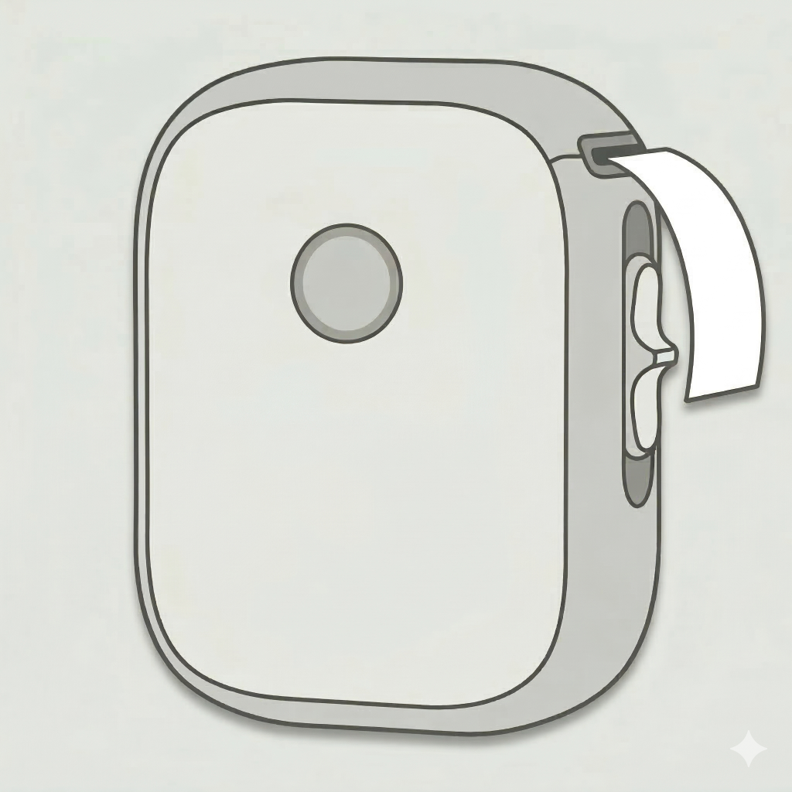

<p align="center">
  
</p>

# Label

A modern Android app for printing labels to Marklife thermal label printers via Bluetooth LE.

## Features

- 🖨️ **Bluetooth LE Printing** – Connect and print to Marklife P12, P15, and L13 label printers
- 📝 **Rich Text Formatting** – Customize font size, family, bold, italic, underline, and alignment
- ⚙️ **Flexible Layout** – Configure padding, alignment, and label dimensions
- 📋 **Multiple Copies** – Print multiple copies of your labels in one go

## Requirements

- Android 8.0 (API 26) or higher
- Marklife label printer (P12, P15, or L13)

## Building

1. Clone the repository:
   ```bash
   git clone https://github.com/ComputedLogic/Label.git
   cd Label
   ```

2. Open the project in Android Studio or build via command line:
   ```bash
   ./gradlew assembleDebug
   ```

3. For release builds, create a `keystore.properties` file based on `keystore.properties.example` with your signing configuration.

## License

This project is licensed under the Apache License 2.0 - see the [LICENSE](LICENSE) file for details.

